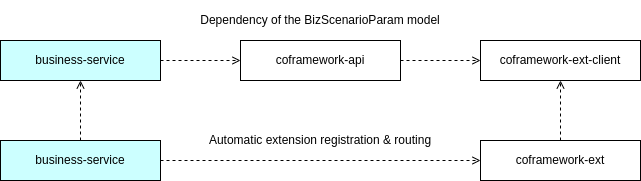
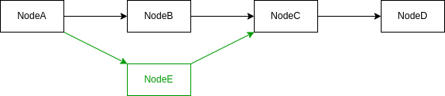
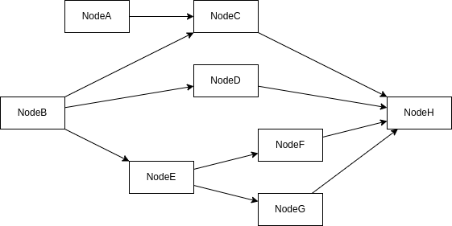
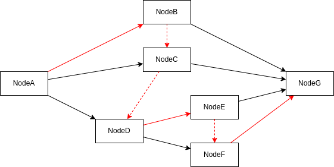
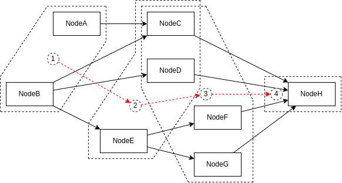

# coframework

Elegant and efficient Java framework

## 1. API Models

API models are standard models that mainly used in but not limited to the API layer.

The framework provided many mechanisms and utilities to automize the using of these models.

| Section   | Class            | Type           | Summary                                                      |
|-----------|------------------|----------------|--------------------------------------------------------------|
| Request   | ApiParam         | interface      | Automatic argument checking                                  |
|           | BizScenarioParam | interface      | Extension routing (in `coframework-ext-client`)              |
|           | BaseRequest      | abstract class | ApiParam + BizScenarioParam                                  |
|           | PageRequest      | abstract class | Same as above, for paged request                             |
| Response  | Result           | class          | Result container, automatic exception wrapping               |
|           | Page             | class          | Paged data container                                         |
| Exception | ApiError         | interface      | Error code and message carrier, automatic exception wrapping |
|           | BaseException    | abstract class | RuntimeException + ApiError                                  |
|           | CommonErrors     | enum           | Common ApiErrors                                             |

Package:

```xml

<dependency>
    <groupId>io.codeone</groupId>
    <artifactId>coframework-api</artifactId>
    <version>...</version>
</dependency>
```

### 1.1 Requests

#### 1.1.1 `ApiParam` interface

`ApiParam` is the interface of all API requests, you can implement it directly, or extend the `BaseRequest` class which
implemented the `ApiParam`.

`ApiParam` has a `checkArgs()` method which will be called **automatically** upon an API invocation. You should throw an
IllegalArgume ntException if there is an unexpected or incorrect argument. The framework also provided a `ArgChecker`
utility which has some handy argument-checking functions.

The content of the `checkArgs()` will be part of the API signatures and will be distributed along with the client jar.
In this way the users of the client will have a clear insight of your APIs and know the requirements exactly.

#### 1.1.2 `BaseRequest` abstract class

`BaseRequest` is the base class of all API requests, which implemented the `ApiParam` and `BizScenarioParam` interfaces.

The implementation of the `BizScenarioParam` means `BaseRequest` will have the business identity of the
caller, which is a necessity in the Extension System.

All properties of `BaseRequest` are lazily instantiated so the overhead is little.

#### 1.1.3 `PageRequest` abstract class

`PageRequest` is the base class of all paged API requests, and is a subclass of the `BaseRequest`.

### 1.2 Responses

#### 1.2.1 `Result<T>` class

`Result<T>` is the wrapping class of the result of all API invocations, and it contains the successfulness, error code,
error message and the actual result.

The framework will convert any exception to a `Result<T>` **automatically** if this is the return type of the API
service.

#### 1.2.2 `Page<T>` class

`Page<T>` is the container class of a paged data, which contains the current page index, size of one page, total number
of data and the list of data of current page.

`Page<T>` alone is NOT a result. To represent a paged result, please use `Result<Page<T>>`.

### 1.3 Exceptions

#### 1.3.1 `ApiError` interface

The `ApiError` interface represents the code and message of an error. When the framework converts an `ApiError` to a
failed `Result<T>`, these properties will be copied to that result.

#### 1.3.2 `BaseException` abstract class

`BaseException` is the base class of all custom exceptions. It has a `code` property since it implemented
the `ApiError`.

#### 1.3.3 `CommonErrors` enumeration

`CommonErrors` are the constants that represent commonly seen `ApiError`s, including two special ones:

1. `CommonErrors#SUCCESS` which indicates there is no error.
2. `CommonErrors#INVALID_PARAM` which is recommended to use when there is an `IllegalArgumentException`.

### 1.4 Specifications and Standards

#### 1.4.1 Request and Response Types

In the **API** layer, all requests should be a `BaseRequest`, and all responses should be the `Result`, since the
framework is depending on these types to do some automatic works.

Other than the API layer, services should **NOT** use the `Result` class as the return type, and should return results
unwrapped. To return a failed result, just throw a `BaseException` with the error code and message, and it will be
wrapped to a `Result` at the API layer by the framework.

#### 1.4.2 Exceptions as Control Flow

As we said before, in the non-API layer, you should throw an exception rather than return a wrapped failed result.

This is the trade-off we like to accept. We value the huge improvement of readability over the little sacrifice of
performance. And in a business system, the creation of an exception (and the stack trace) is never really an expense.

## 2. Plugin System

Plugin is a very convenient yet powerful way to write aspect-like logic.

Package:

```xml

<dependency>
    <groupId>io.codeone</groupId>
    <artifactId>coframework-plugin</artifactId>
    <version>...</version>
</dependency>
```

### 2.1 Regular Plugins

Regular plugins are the most common plugins. You can enable them by specifying individual classes of them.

#### 2.1.1 Defining a Plugin

To define a Plugin, you just need to implement a subclass of the `BasePlugin` class, and override some of its five
methods: `around()`, `before()`, `after()`, `afterThrowing()` and `afterReturning()`:

```java

@Plug(Stages.BEFORE_TARGET)
public class RtPlugin extends BasePlugin {

    @Override
    public Object around(TargetMethod targetMethod, Object[] args,
                         Invokable<Object> invokable) throws Throwable {
        long start = System.currentTimeMillis();
        try {
            return invokable.invoke();
        } finally {
            System.out.println(targetMethod.getMethod() + " cost "
                    + (System.currentTimeMillis() - start) + "ms");
        }
    }
}
```

#### 2.1.2 Plugin Stages and Orders

All plugins must be annotated by the `@Plug` annotation. In here you can specify what stage the plugin is in. There are
eight stages available:

| Stage              | Order Value | Main Logic in | Summary                         |
|--------------------|-------------|---------------|---------------------------------|
| ARG_INITIALIZATION | 0           | before        | Initializes/Supplies args       |
| ARG_VALIDATION     | 1           | before        | Validates args                  |
| ARG_UPDATING       | 2           | before        | Updates args                    |
| BEFORE_TARGET      | 3           | before        | Other actions before the target |
| AFTER_TARGET       | -4          | after         | Other actions after the target  |
| RESULT_VALIDATION  | -5          | after         | Validates the result            |
| RESULT_UPDATING    | -6          | after         | Updates the result/exception    |
| EXCEPTION_HANDLING | -7          | after         | Handles/Wraps the exception     |

The stage of plugins decides their order in a chain, but the order of stages/plugins is not the same as the order of the
methods. You have to set the right stage and put the main logic in the right part of your plugins to achieve the desired
logic order, as the diagram shows below:


You can use the `@Order` annotation to further specify the order of plugins that belong to the same stage, if that
matters:

```java

@Plug(Stages.BEFORE_TARGET)
@Order(Integer.MAX_VALUE - 1)
public class PluginA extends BasePlugin {
}
```

#### 2.1.3 Using a Plugin

To use a plugin, just add the `@EnablePlugin` annotation to the target class/method:

```java

@Service
@EnablePlugin({PluginA.class, PluginB.class})
public class TestService {

    public void withPluginAnB() {
    }

    @EnablePlugin({PluginC.class, PluginD.class})
    public void withPluginCnD() {
    }
}
```

> Annotations on methods have higher priority than these on classes.

#### 2.1.4 Cross-Plugin Context

The Plugin System provided a cross-plugin context i.e. the `PluginChainContext`:

```java

@Plug(Stages.BEFORE_TARGET)
public class ContextWriterTestPlugin extends BasePlugin {

    @Override
    public void before(TargetMethod targetMethod, Object[] args) {
        PluginChainContext.put("test", true);
    }
}

@Plug(Stages.AFTER_TARGET)
public class ContextReaderTestPlugin extends BasePlugin {

    @Override
    public Object after(TargetMethod targetMethod, Object[] args,
                        Object result, Throwable error) throws Throwable {
        boolean test = PluginChainContext.get("test");
        return super.after(targetMethod, args, result, error);
    }
}
```

> Please note that `PluginChainContext` is based on `ThreadLocal` so it's not working with multi-threads.

### 2.2 Plugin Groups and Pluggers

Specifying individual classes everytime may not be the best way to enable plugins, some plugins and some types of target
are connected and should be bound together.

#### 2.2.1 Plugin Groups

You can use the `@Plug` annotation to assign a group to a plugin, and use that group to select multiple plugins at once
later:

```java

@Plug(value = Stages.ARG_UPDATING, group = PluginConstants.GROUP_GATEWAY)
public class GatewayParamEnhancePlugin extends BasePlugin {
}
```

#### 2.2.2 The MethodPlugger

You can write a custom `MethodPlugger` to enable a group of plugins, multiple individual plugins, or their combination.

For example, the following 'GatewayPlugger' is a plugger, and it tells the Plugin System that, classes or methods
annotated by the '@Gateway' annotation should be applied plugin group "GATEWAY", the 'LoggingPlugin' and the
'StatisticPlugin':

```java

@Component
public class GatewayPlugger extends AnnotationMethodPlugger<Gateway> {

    @Override
    protected Class<Gateway> getAnnotationType() {
        // Uses annotation 'Gateway' to locate target classes/methods.
        return Gateway.class;
    }

    @Override
    protected List<Plugging> getPluggingList(Method method, Gateway anno) {
        // Plugs a group of plugins.
        return Plugging.asList(GroupPlugging.of(PluginConstants.GROUP_GATEWAY),
                // And pluses two individual ones.
                ClassPlugging.of(LoggingPlugin.class, StatisticPlugin.class));
    }
}
```

```java
/**
 * Methods of this class will be plugged with plugin group "GATEWAY",
 * the LoggingPlugin and the StatisticPlugin.
 */
@Gateway
public class SystemAGatewayImpl extends SystemAGateway {
}
```

> `AnnotationMethodPlugger<A>` is a subclass of `MethodPlugger` which can locate target classes/methods by annotations.

> '@Gateway' is one of your own annotations.

### 2.3 API Plugins and the Specifications

Using the `@API` annotation to introduce automatically the abilities of **argument-checking**, **logging**,
**exception-wrapping** and much more to your API services.

You need to import the `coframework-core-api` in your project to make it work automatically.

```xml

<dependency>
    <groupId>io.codeone</groupId>
    <artifactId>coframework-core-api</artifactId>
    <version>...</version>
</dependency>
```

#### 2.3.1 API Plugins

API plugins are special plugins which are:

1. In the group "API" (io.codeone.framework.api.ApiConstants.PLUGIN_GROUP).
2. Enabled by the `@API` annotation. Please make sure the target class has an API semantics, i.e. is a service of the
   API layer.

You can add your own API plugin like this:

```java

@Plug(value = Stages.ARG_VALIDATION, group = ApiConstants.PLUGIN_GROUP)
public class MyApiPlugin implements Plugin {

    @Override
    public void before(TargetMethod targetMethod, Object[] args) {
    }
}
```

#### 2.3.2 Pre-defined API Plugins

There are three pre-defined API plugins that work with the `@API` annotation:

| Plugin               | Stage              | Group      | Summary                           |
|----------------------|--------------------|------------|-----------------------------------|
| ArgCheckingApiPlugin | ARG_VALIDATION     | API        | Args checking for `ApiParam`      |
| LoggingPlugin        | AFTER_TARGET       | (by class) | Logging                           |
| ExToResultApiPlugin  | EXCEPTION_HANDLING | API        | Exception wrapping to `Result<T>` |

## 3. Extension System

The framework provided a super straightforward and easy to use Extension System, to support the case that some services
may want to have different logics for different consumers and/or scenarios.

There is an example:

1. To define an ability:

   ```java
   
   @Ability
   public interface ActivityAbility {
   
       void startActivity(StartAbilityParam param);
   }
   ```

2. To implement the ability for a specific business, e.g. a "global business unit":

   ```java
   
   @Extension(bizId = BizIdConstants.BIZ_GLOBAL)
   public class BizGlobalActivityAbility implements ActivityAbility {
   
       @Override
       void startActivity(StartAbilityParam param) {
           // Custom logics for the BizIdConstants.BIZ_GLOBAL.
       }
   }
   ```
   > The ability can have different implementations for different businesses/scenarios.

3. Invoking the ability, just like to invoke a normal service:

   ```java
   
   @Service
   public class ActivityDomainServiceImpl implements ActivityDomainService {
   
       @Resource
       // Uses the interface to refer to the ability.
       private ActivityAbility activityAbility;
   
       @Override
       void startActivity(StartAbilityParam param) {
           // And uses the 'BizScenario' in the param to locate the actual
           // implementation, and the invoker does not care which one it is.
           activityAbility.startActivity(param);
       }
   }
   ```

And that's it, as simple as a regular service interface, implementation, and invocation.

Packages:

Your client should ONLY import this package, for all the models:

```xml

<dependency>
    <groupId>io.codeone</groupId>
    <artifactId>coframework-ext-client</artifactId>
    <version>...</version>
</dependency>
```

Your service should import this package, to make them work automatically:

```xml

<dependency>
    <groupId>io.codeone</groupId>
    <artifactId>coframework-ext</artifactId>
    <version>...</version>
</dependency>
```



### 3.1 Business Identities and Scenarios - The `BizScenario` Model

A **business identity** represents a business entity who consumes the services, for example, the user team of the global
business unit.

And a **scenario** is a different usage of the same service, for example, a discount activity but specifically for the
New Year.

The Extension System provided a `BizScenario` model for this purpose, which has `bizId` and `scenario` properties to
carry these two information respectively, for example, `BizScenario.of("BIZ_GLOBAL.TEAM_USER", "holiday.new-year")`.

A valid bizId/scenario should be a `*` (which means ANY), or `.` seperated keywords which are composed of alphabets,
numbers, `-` or `_`.

> For compatibility reason, `null` and empty string are acceptable and be treated as `*`.

### 3.2 Extensible and Extensions

An **Extensible** is an interface which can have different implementations for each business identity/scenario. The
Extension System uses the `@Ability` or `@ExtensionPoint` annotation to mark an **Extensible**.

An **Extension** is one of these implementations for an **Extensible**. The Extension System uses the `@Extension`
annotation with `bizId` and `scenario` attributes to mark one **Extension**.

In the example above, 'ActivityAbility' is an **Extensible**, and 'BizGlobalActivityAbility' is an **Extension** which
is customized for the 'BizIdConstants.BIZ_GLOBAL' business.

### 3.3 Layers of Extensible: The Ability and ExtensionPoint

Having only one kind of extensions is barely enough for a medium or large business system. The Extension System
abstracted two concepts to ease this problem:

1. **Ability**: An ability indicates what operations/tasks a system can complete. An ability could be an API service, a
   domain service, or a component those services orchestrate, whatever suitable for the scale of your system. Methods of
   the ability can represent sub-abilities, steps of the ability, extension points of the ability, etc.

   You can use the `@Ability` annotation to mark an interface as an ability.

2. **ExtensionPoint**: An extension point (and it methods) usually represents a set of rules, configurations or
   strategies. It is a rather smaller variation compared to the ability.

   You can use the `@ExtensionPoint` annotation to mark an interface as an extension point.

### 3.4 Routing of Extensions

The Extension System uses a `BizScenario` argument, which is either retrieved from a `BizScenarioParam` parameter, or
from the `BizScenarioContext`, to route an actual **Extension** implementation of an **Extensible** interface.

> A `BizScenario` is also a `BizScenarioParam`:
>
> `@Override public BizScenario getBizScenario() { return this; }`

#### 3.4.1 Coordinate of an Extension

You can use the `@Extension` annotation with `bizId` and `scenario` attributes to specify the "coordinate" of an
extension:

```java

@Extension(bizId = "BIZ_GLOBAL.TEAM_USER", scenario = "holiday.new-year")
public class BizGlobalActivityAbility implements ActivityAbility {
}
```

Or using an array of constants:

```java

@Extension(bizId = {BizIdConstants.BIZ_GLOBAL, BizIdConstants.TEAM_USER},
        scenario = "holiday.new-year")
public class BizGlobalActivityAbility implements ActivityAbility {
}
```

#### 3.4.2 Location of the `BizScenario` Argument

There are several ways to locate a `BizScenario` argument, listed in order of priority:

```java

@Ability
public interface DemoAbility {

    // 1. Routes by context if has zero parameter.
    void withZeroParam();

    // 2. Routes by param1 as it is annotated by @RouteBy.
    void withRouteBy(@RouteBy MyBizScenarioParam param1,
                     MyBizScenarioParam param2);

    // 3. Routes by context because of the @RouteByContext annotation.
    @RouteByContext
    void withRouteByContextOnMethodOrInterface(MyBizScenarioParam param);

    // 4. Routes by param1 since it is the only candidate.
    void withOnlyOneQualifiedParam(MyBizScenarioParam param1,
                                   Long param2);
}
```

1. Uses the `BizScenario` object at the top of the `BizScenarioContext`'s stack, if the method of the **Extensible**
   interface has zero parameter.
   > The `BizScenarioContext` has a stack of `BizScenario` objects. Whenever a `BizScenario` argument is being used, it
   will be pushed into that stack (and popped after).
2. Uses the one `BizScenarioParam` parameter which is annotated by the `@RouteBy` annotation.
3. Uses the `BizScenario` object from the `BizScenarioContext` if the method or interface is annotated by
   the `@RouteByContext` annotation.
4. Uses the only `BizScenarioParam` parameter.
5. Uses the `BizScenario` object from the `BizScenarioContext` if the application
   property `coframework.ext.route-by-context-by-default` is true.

> An exception will be thrown if none of these above could get a `BizScenario` object.

#### 3.4.3 Matching Order of the BizScenario

An **Extension** looking-up will happen, if the `bizId` and `scenario` of the `BizScenario` argument could not match
the "coordinate" of one **Extension** exactly. The Extension System will try to widen the `scenario` then the `bizId` to
find an **Extension**.

For example, for the `("BIZ_GLOBAL.TEAM_USER", "holiday.new-year")` `BizScenario` argument, the Extension System will
try to match it with the following **Extension** "coordinates" in order:

```text
("BIZ_GLOBAL.TEAM_USER", "holiday.new-year")
("BIZ_GLOBAL.TEAM_USER", "holiday")
("BIZ_GLOBAL.TEAM_USER", "*")
("BIZ_GLOBAL", "holiday.new-year")
("BIZ_GLOBAL", "holiday")
("BIZ_GLOBAL", "*")
("*", "holiday.new-year")
("*", "holiday")
("*", "*")
```

> An exception will be thrown if the Extension System could not find any **Extension** for the specified `BizScenario`
> argument.

### 3.5 Extension Sessions and Globally Routing-by-Context

The Extension System provided several utilities to manage an "extension session" and the `BizScenario` objects in it.

> An extension session is a session in which all the **Extensible** invocations and routing happen.

#### 3.5.1 The Global Routing-by-Context Setting

Designing the routing approaches for every **Extensible** interface might be quite a chore. For example, you need to
make some specifications such as every **Ability** method should have one `BizScenarioParam` parameter, and every
**ExtensionPoint** interface should be annotated by the `@RouteByContext`.

Instead, you can set the application property `coframework.ext.route-by-context-by-default` true to make all
**Extensible** route by context:

```properties
coframework.ext.route-by-context-by-default=true
```

#### 3.5.2 Automatic Extension Sessions

By setting the `coframework.ext.route-by-context-by-default` property, you need to make sure there is a `BizScenario`
object in the stack of the `BizScenarioContext` upon the calling of an **Extensible**. The Extension System provided an
`@ExtensionSession` annotation to do this job.

The `@ExtensionSession` annotation set up a plugin, which will try to resolve a `BizScenario` object from the arguments,
put it in the stack, and then call the actual method.

There is an example that adds `@ExtensionSession` on the main entrance service:

```java

@Service
@ExtensionSession(/* BizScenarioResolvePolicy.AUTO */)
public class MyFacadeServiceImpl implements MyFacadeService {

    @Resource
    private MyAbility myAbility;

    public void operates(MyParam param) {
        // Without parameters but still can route.
        myAbility.operatesWoParam();
    }
}
```

You can specify how the `@ExtensionSession` resolves a `BizScenario` object:

| Resolving Approach                                                                                                 | Summary                                                                                                                      |
|--------------------------------------------------------------------------------------------------------------------|------------------------------------------------------------------------------------------------------------------------------|
| `@ExtensionSession(`<br/>`BizScenarioResolvePolicy.FIRST)`                                                         | Using the first `BizScenarioParam` parameter                                                                                 |
| `@ExtensionSession(`<br/>`BizScenarioResolvePolicy.LAST)`                                                          | Using the last `BizScenarioParam` parameter                                                                                  |
| `@ExtensionSession(`<br/>`BizScenarioResolvePolicy.SPECIFIED)`                                                     | Using the `BizScenarioParam` parameter that annotated by the `@ResolveFrom`                                                  |
| `@ExtensionSession(`<br/>`/* value = BizScenarioResolvePolicy.CUSTOM, */`<br/>`customResolver = MyResolver.class)` | Using a specified `BizScenarioResolver` bean                                                                                 |
| `@ExtensionSession(`<br/>`/* BizScenarioResolvePolicy.AUTO */)` (the default)                                      | As same as `BizScenarioResolvePolicy.CUSTOM`, `BizScenarioResolvePolicy.SPECIFIED` and then `BizScenarioResolvePolicy.FIRST` |

You can use the `BizScenarioResolver` to write some custom resolving logic, for example:

```java

@Component
public class BuBizScenarioResolver implements BizScenarioResolver {

    @Override
    public BizScenario resolve(Object[] args) {
        Long buId = getBuId(args);
        return buBizIdMap.getOrDefault(buId, DEFAULT_BIZ_SCENARIO);
    }
}
```

#### 3.5.3 Manual Extension Sessions

You may need to start extension sessions manually, for example, to handle multiple loaded business objects in a loop, in
which each of them has a different `BizScenario` property.

There is an `ExtensionUtils` that you can use:

```java
class Demo {
    void demo() {
        for (MyBO myBO : myBOs) {
            ExtensionUtils.invoke(myBO.getBizScenario(), () -> {
                // Handling myBO. 
            });
        }
    }
}
```

### 3.6 Monitoring

You can trace the registration of all **Extensible** and **Extensions** by supplying one `BaseAbilityScanner`
and `BaseExtensionPointScanner` beans.

And you can monitor the execution of all **Extensions** by adding one `ExtInvocationMonitor` bean to your project.

## 4. Chain System

Using chains is an effective way to orchestrate and reuse functionalities. The Chain System provided a standard Directed
Acyclic Graph (DAG) chain mechanism, and an approach to extend the chain in an extensible environment at runtime, also
the ability to execute nodes of a chain asynchronously and concurrently.

Package:

```xml

<dependency>
    <groupId>io.codeone</groupId>
    <artifactId>coframework-chain</artifactId>
    <version>...</version>
</dependency>
```

### 4.1 Types of Nodes

There are 5 types of chain nodes:

| Type                 | Summary                                                                                                              |
|----------------------|----------------------------------------------------------------------------------------------------------------------|
| `SignNode`           | Non-functional, "signposts/waypoints/anchors" in graph, exposed to extenders of the chain, global re-usability       |
| `TargetFilter<T>`    | `filter(List<T> target, ...)` method, filters out unwanted elements from a collection, same-target-type re-usability |
| `TargetRenderer<T>`  | `render(T target, ...)` method, fills information to/updates attributes of the target, same-target-type re-usability |
| `TargetProcessor<T>` | `process(T target, ...)` method, processes the target, same-target-type re-usability                                 |
| `ContextProcessor`   | `process(Context, ...)` method, processes the arguments in the context, target-type-independent re-usability         |

We will discuss and give examples of them later.

### 4.2 The Target and the Context

The target is the object the chain operates on, and the context contains the target, the initial input arguments of the
chain, and the input/output arguments of each node.

The Chain System provided a `Context<T>` class to represent the context, in which the `T` is the type of the target.

You can use the `KeyMap` type if you need a container of dynamic, extensible data as the target, and it can work
seamlessly with the `Context<T>`.

Both `Context<T>` and `KeyMap` can use `Key` to access their content. The `Key` interface has a `namespace` attribute to
achieve key isolation, and has a `clazz` attribute to perform basic content type validation.

There are some examples:

Custom `Key` enumerations:

```java

@RequiredArgsConstructor
@Getter
public enum MyKeys implements Key {
    /**
     * User id.
     */
    USER_ID(Long.class),
    /**
     * The User entity. 
     */
    USER(User.class),
    ;

    private final Class<?> clazz;
}
```

A target-type-independent, reusable User entity loader:

```java

@Component
public class UserLoader extends ContextProcessor {

    @Override
    protected boolean process(Context<?> context, Logger logger) {
        Long userId = context.getArgument(MyKeys.USER_ID);
        if (userId == null) {
            throw new IllegalArgumentException();
        }
        context.setArgumentIfAbsent(MyKeys.USER, () -> loadUser(userId));
        return false;
    }
}
```

Renders loaded User entity into current target:

```java

@Component
public class UserRenderer extends TargetRenderer<Data> {

    @Override
    protected Data render(Data target, Context<?> context, Logger logger) {
        return context.copyTo(target, MyKeys.USER);
    }
}
```

The `Context<T>` also supports accessing its context via classes:

```java
public class Demo {

    public void demo(Context<?> context, MyEntity myEntity) {
        context.setArgument(myEntity);
        Assertions.assertEquals(myEntity, context.getArgument(MyEntity.class));
    }
}
```

### 4.3 Linear Chains

A linear chain is the simplest chain:


You can form such a chain by containing only one single `Path`:

```java

@Service
public class Demo {

    // Define the spec.
    private static final ChainSpec CHAIN_SPEC = ChainSpec.of(ChainNames.CHAIN_A,
            Path.of(NodeA.class, NodeB.class, NodeC.class, NodeD.class));

    @Resource
    private ChainFactory chainFactory;

    public Data demo() {
        // Create the chain.
        Chain<Data> chain = chainFactory.getChain(CHAIN_SPEC);
        // Create a context.
        Context<Data> context = Context.of(Data.of());
        // Execute the chain.
        return chain.execute(context);
    }
}
```

### 4.4 Extending a Chain

Sometimes we need to create a chain based on an existing one, rather than to specify the whole path over again.

#### 4.4.1 Extending the Spec

To extend a chain spec, all you have to do, is to add an extra path `Path.of(NodeD.class, NodeE.class)` to it:


```java

@Service
public class Demo {

    // The original spec.
    private static final ChainSpec CHAIN_SPEC = ChainSpec.of(ChainNames.CHAIN_A,
            Path.of(NodeA.class, NodeB.class, NodeC.class, NodeD.class));

    public void demo() {
        // Extend the spec.
        ChainSpec derivedSpec = ChainSpec.of(CHAIN_SPEC, Path.of(NodeD.class, NodeE.class));

        Chain<Data> chain = chainFactory.getChain(derivedSpec);
        // ...
    }
}
```

What if we extend the spec this way?



`ChainSpec derivedSpec = ChainSpec.of(CHAIN_SPEC, Path.of(NodeA.class, NodeE.class, NodeC.class));`

It is totally legal, the Chain System supports DAG, which we will discuss later.

#### 4.4.2 Using ChainExtensions

It is difficult to use `public static ChainSpec of(ChainSpec source, Path<Class<? extends Node>>... paths)` to extend a
chain spec, if there are more than one extender. They have to know each other and be coupled in order to give the
`source` parameter.

The Chain System provided a `ChainExtension` to achieve this task, there is an example:

In where the chain is being used, apply a `ChainExtension` while using the chain:

```java

@Service
public class Demo {

    private Data useTheChain(ChainExtension chainExtension) {
        // Use the chainExtension to extend the chain.
        Chain<Data> chain = chainFactory.getChain(CHAIN_SPEC, chainExtension);
        // Use the chainExtension to extend the context i.e. arguments.
        return chain.execute(Context.of(Data.of()), chainExtension);
    }
}
```

And in somewhere in a business extension package, use the same `ChainExtension` to record any change to the chain and
the arguments, BEFORE the using of the chain of course:

```java

// An extension for BIZ_GLOBAL.
@Extension(bizId = BizIdConstants.BIZ_GLOBAL)
public class GlobalChainExt implements ChainExtPt {

    @Override
    public void extendTheChainAndArgs(ChainExtension chainExtension) {
        chainExtension
                // Add node NodeE after the NodeD,
                .addPath(Path.of(NodeD.class, NodeE.class))
                // and its args.
                .addArgument(Keys.PARAM_FOR_NODE_E, "foo");
    }
}
```

#### 4.4.3 The SignNodes

Sign (Signpost) nodes are non-functional nodes that assist the formation of the graph of a chain, for example, connect
other functional nodes.

Subclasses of sign nodes should be defined by the provider of the chain, and put at somewhere that is visible to the
extenders of the chain, e.g. an SDK, so that `ChainExtension#addPath(Path)` can use them as "anchors".

For example, in the SDK package, define some "stage nodes":

```java

@Component
public class StagePreparing extends SignNode {
}

@Component
public class StageComputing extends SignNode {
}
```

In the main package, arrange a chain spec around those "stage nodes":

```java

@Service
public class Demo {

    private static final ChainSpec CHAIN_SPEC = ChainSpec.of(ChainNames.CHAIN_A,
            Path.of(StagePreparing.class,
                    ArgumentASupplier.class,
                    ArgumentBSupplier.class,
                    StageComputing.class,
                    ResultCalculator.class));
}
```

And in a business extension package, use those "stage nodes" as "anchors", without awareness of other nodes from the
main package or other extension packages:

```java

// An extension for BIZ_GLOBAL.
@Extension(bizId = BizIdConstants.BIZ_GLOBAL)
public class GlobalChainExt implements ChainExtPt {

    // Record how to change the chain and to supply extra arguments.
    @Override
    public void extendTheChainAndArgs(ChainExtension chainExtension) {
        chainExtension
                // Add node ArgumentCSupplier between the StagePreparing and StageComputing.
                // The exact order, i.e. the order between ArgumentASupplier, ArgumentBSupplier and ArgumentCSupplier
                // does not matter.
                .addPath(Path.of(StagePreparing.class, ArgumentCSupplier.class, StageComputing.class));
    }
}
```

### 4.5 DAG of Nodes

As we mentioned before, the whole Chain System is backed by Directed Acyclic Graph. A functioning chain can be as
complex as the following diagram:



Nodes in a DAG will be executed, if and only if all of their dependencies are finished.

Technically, we can not stop the developers from providing a cyclic graph, mistakenly or intentionally. The Chain System
**DOES NOT THROW ANY EXCEPTION** in such case, but any node in a circle will not be executed because its dependencies
will never be finished.

### 4.6 Synchronous and Asynchronous Executions

One advantage of DAG is that their vertices (nodes) can be processed simultaneously, if they do not depend on or affect
each other.

Firstly, let's see how to execute a DAG chain in a synchronous, linear fashion:

```java

@Service
public class Demo {

    public Data demo() {
        // ...
        // Execute the chain.
        return chain.execute(context);
    }
}
```

One node will be executed, if and only if all of its dependencies are finished. So **ONE** of the possible execution
orders is look like this (in RED lines):



Secondly, a DAG chain can also be executed in an asynchronous, concurrent manner, to improve the performance:

```java

@Service
public class Demo {

    public Data demo() {
        // ...
        // Execute the chain, asynchronously.
        return chain.executeAsync(context, /* java.util.concurrent.Executor */ executor);
    }
}
```

A node will be put into the thread pool, if and only if all of its dependencies are finished. So the nodes grouped by
dashed line in the following diagram, might be executed concurrently:



> You need to make sure those nodes in the thread pool do not race each other. For example, those nodes that access
> different keys in a concurrent map, can be put parallel. And those who operate the same attribute, should be arranged
> in a series, i.e. form a direct or indirect dependency.

## 5. General Logging Tool

The framework provided two built-in logging mechanisms: The `Log` class and the `@Logging` annotation. Both of them will
output some "standard" logs that can be easily parsed and analyzed.

Package:

```xml

<dependency>
    <groupId>io.codeone</groupId>
    <artifactId>coframework-logging</artifactId>
    <version>...</version>
</dependency>
```

### 5.1 The Standard Format

The framework defined its own standard format for logging.

There are some examples:

`||level=>INFO||scene=>myScene||method=>MyService.operates||success=>true||elapsed=>10||arg.myParam=>MyParam(type=0)||result=>1`

`||level=>ERROR||scene=>myScene||method=>MyService.operates||success=>false||code=>SYS_ERROR||message=>System error||elapsed=>10||arg.myParam=>MyParam(type=0)||error=>...`

### 5.2 The `Log`

The `Log` is a utility class that can output standard logs:

```
Log.newBuilder()
        .logger("myLoggerName")
        .scene("myScene")
        .method("operates")
        .addArg("myParam", myParam)
        .error(t)
        .log();
```

### 5.3 The `@Logging`

The `@Logging` annotation can be used on any method/class of a spring bean, and it will help to log the signature,
arguments and the result of the method(s).

Furthermore, The `@Logging` annotation can recognize the `ApiError` and `Result<T>` classes, and log the successfulness,
error code and error message correctly:

```java

@Logging
@Service
public class MyService {

    public void withLoggingOnClass(MyParam param) {
    }

    @Logging
    public void withLoggingOnMethod(MyParam param) {
    }

    @Logging(value = LoggingPresets.ARGS_ONLY,
            name = "myLogger",
            scene = "myScene",
            delimiter = LogDelimiters.SIMPLE)
    public void withMoreControls(MyParam param) {
    }
}
```
