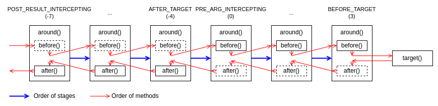

# Co-Framework

An Elegant and Efficient Java Business Framework

**Co-Framework** is a modern business framework designed for Java developers. It provides out-of-the-box API
enhancements, a flexible plugin system, chain-based process orchestration, and dynamic business capability routing. By
simplifying repetitive tasks, improving code consistency, and enhancing extensibility, it accelerates development and
reduces maintenance costs. It is well-suited for complex business scenarios that require high development efficiency and
scalability.

---

## 1. Getting Started

Here’s how to quickly experience the core features of Co-Framework:

### 1.1 API Enhancements: Enable Powerful Features with a Single Annotation

#### 1.1.1 Key Features

- **Parameter Validation**: Automatically invokes the `validate()` method to ensure input validity.
- **Exception Wrapping**: Automatically converts exceptions into user-friendly API responses.
- **Call Logging**: Logs API calls, including successes, failures, and exceptions.

#### 1.1.2 Quick Start

1. **Add Maven Dependency**:

```xml

<dependency>
    <groupId>io.codeone</groupId>
    <artifactId>coframework-api-core</artifactId>
    <version>${coframework.version}</version>
</dependency>
```

2. **Apply the `@API` Annotation**:

```java
// Class-level annotation applies to all methods
@API
public class BizApiImpl implements BizApi {
    // Method-level annotation applies to a single method
    @API
    public Result<BizData> getData(BizParam param) {
    }
}
```

3. **Parameter Validation Example**:

```java
public class BizParam extends BaseParam {
    // Validates arguments and aborts API invocation if validation fails
    @Override
    public void validate() {
        Validator.requireNonNull(userId, "userId is null");
    }
}
```

4. **Automatic Exception Handling**:

```java
// Returns a failed response Result.failure("ACCESS_DENIED", message) instead of throwing an exception
public Result<BizData> getData(BizParam param) {
    throw new ApiException(ClientErrorCodes.ACCESS_DENIED, message);
}
```

5. **Call Logging**:

API call logs include results, error codes, and messages automatically—no extra configuration required.

### 1.2 Plugin System: Flexible Interception

#### 1.2.1 Key Features

- **More Flexible than AOP**: Works well for complex scenarios.
- **Multi-Phase, Multi-Plugin Binding**: Supports dynamic binding at multiple stages.

#### 1.2.2 Quick Start

1. **Add Maven Dependency**:

```xml

<dependency>
    <groupId>io.codeone</groupId>
    <artifactId>coframework-plugin</artifactId>
    <version>${coframework.version}</version>
</dependency>
```

2. **Define a Plugin**:

```java
// Specify the order of the plugin, and the activating target annotations
@Plug(value = Stages.BEFORE_TARGET, targetAnnotations = BizProcess.class)
public class BizProcessPlugin implements Plugin {
    @Override
    public void before(Method method, Object[] args) {
        // Plugin logic
    }
}
```

3. **Apply the Plugin**:

```java
// Activates the plugin via the target annotation
@BizProcess
public Result<BizData> getData(BizParam param) {
}
```

### 1.3 Chain System: Flexible Process Orchestration

#### 1.3.1 Key Features

- **Chained Calls**: Simplifies complex business processes.
- **Modular Nodes**: Independent and reusable, enhancing code modularity.

#### 1.3.2 Quick Start

1. **Add Maven Dependency**:

```xml

<dependency>
    <groupId>io.codeone</groupId>
    <artifactId>coframework-chain</artifactId>
    <version>${coframework.version}</version>
</dependency>
```

2. **Define Chain Nodes**:

```java

@Component
public class Produce implements Chainable {
    @Override
    public boolean execute(Context context) {
        context.put(String.class, "content");
        return true;
    }
}

@Component
public class Consume implements Chainable {
    @Override
    public boolean execute(Context context) {
        assert "content".equals(context.get(String.class));
        return true;
    }
}
```

3. **Orchestrate and Execute the Chain**:

```java

@Service
public class ChainService {
    @Autowired
    private Produce produce;
    @Autowired
    private Consume consume;

    public void run() {
        Sequential.of(produce, consume).run(Context.of());
    }
}
```

### 1.4 Extension System: Dynamic Multi-Implementation Routing

#### 1.4.1 Key Features

- **Dynamic Routing**: Route requests to different implementations based on business context.
- **Enhanced Extensibility**: Minimize redundant development by adding new implementations as needed.

#### 1.4.2 Quick Start

1. **Add Maven Dependency**:

```xml

<dependency>
    <groupId>io.codeone</groupId>
    <artifactId>coframework-ext</artifactId>
    <version>${coframework.version}</version>
</dependency>
```

2. **Define an Extensible Interface**:

```java
// Marks Extensible interface via @Ability or @ExtensionPoint
@Ability
public interface BizAbility {
    void execute(BizScenario bizScenario);
}
```

3. **Provide Different Implementations**:

```java
// Specific implementation for bizId "manager"
@Extension(bizId = "manager")
public class BizAbilityForManager implements BizAbility {
    @Override
    public void execute(BizScenario bizScenario) {
        // Custom logic
    }
}
```

4. **Invoke with Dynamic Routing**:

```java

@Service
public class BizService {
    // Reference the interface, not implementations
    @Autowired
    private BizAbility bizAbility;

    public void executeBizAbility() {
        // Will route to BizAbilityForManager
        bizAbility.execute(BizScenario.ofBizId("manager"));
    }
}
```

---

## 2. Advanced API Enhancements

Co-Framework offers advanced features to help developers customize exception handling, logging, and integration with
existing systems. Below are the details of these advanced capabilities.

### 2.1 Customizing Exception Wrapping

1. **Custom Error Codes**: To customize the `errorCode` in the response (default: the exception class name), implement
   the `ApiError` interface or use `ApiException`. The `errorCode` will be derived from the `getCode()` method.

2. **Custom Error Messages**: To customize the `errorMessage` in the response (default: the exception message), such as
   hiding technical details from end users, use the `@CustomErrorMessage` annotation:

```java

@API
@CustomErrorMessage("System is busy, please try again later.")
public Result<BizData> getData(BizParam param) {
}
```

### 2.2 Specifying Error Log Levels

The `ApiError.critical` field determines whether the corresponding log is recorded as `error` or `warn`.

You can specify the error log level by throwing an exception of type `ApiError` (e.g., `ApiException`):

```java
public Result<BizData> getData(BizParam param) {
    // warn - ClientErrorCodes.INVALID_ARGS.critical = false
    throw new ApiException(ClientErrorCodes.INVALID_ARGS, message);
    // error - ServerErrorCodes.INTERNAL_SYS_ERROR.critical = true
    throw new ApiException(ServerErrorCodes.INTERNAL_SYS_ERROR, message);
    // You can customize the error log level by implementing ApiError, like ClientErrorCodes or ServerErrorCodes
    throw new ApiException(MyErrorCodes.MY_CODE, message);
    // Alternatively, you can directly pass the code and critical level
    throw new ApiException(code, critical, message);
}
```

### 2.3 Customizing Call Logging

The `@Logging` annotation provides control over call logging behavior, such as whether to log parameters and return
values:

```java

@API
@Logging(logArgs = false, logResult = false, argKvs = {"userId", "#a0?.userId"})
public Result<BizData> getData(BizParam param) {
}
```

For detailed configuration options, refer to the **6. Logging** section.

### 2.4 Integrating with Existing Systems

The framework supports enhancing existing system APIs through various types of `Converter` implementations.

1. **`ApiParamConverter`**: Converts legacy API parameters with validation capabilities into `ApiParam`, enabling
   automatic activation via `@API`:

```java

@Component
public class MyParamApiParamConverter implements ApiParamConverter<MyParam> {
    @Override
    public ApiParam convert(MyParam source) {
        return source::check;
    }
}
```

2. **`ApiResultConverter`**: Transforms the return type of legacy APIs into `ApiResult` to accurately log success, error
   codes, and error messages:

```java

@Component
public class MyResultApiResultConverter implements ApiResultConverter<MyResult<?>> {
    @Override
    public ApiResult<?> convert(MyResult<?> source) {
        return source.isSuccess()
                ? Result.success(source.getData())
                : Result.failure(source.getErrorCode(), source.getErrorMessage());
    }
}
```

3. **`ApiErrorConverter`**: Converts exceptions into `ApiError`, allowing for proper logging levels, recording error
   codes, and wrapping failure results:

```java

@Component
public class MyExceptionApiErrorConverter implements ApiErrorConverter<MyException> {
    @Override
    public ApiError convert(MyException source) {
        return ApiError.of("ERR_" + source.getCode(), true, source.getMessage());
    }
}
```

4. **`FailureConverter`**: Wraps `ApiError` into the legacy API response model to return failure results instead of
   throwing exceptions:

```java

@Component
public class MyExceptionFailureConverter implements FailureConverter<MyResult<?>> {
    @Override
    public MyResult<?> convert(ApiError source) {
        return MyResult.failed(source.getErrorCode(), source.getErrorMessage());
    }
}
```

---

## 3. Advanced Plugin System Usage

The plugin system provides powerful extensibility, making it ideal for complex business scenarios. Below are details on
controlling plugin execution order, dynamic binding, and fine-grained plugin management through SPI.

### 3.1 Plugin Execution Order

- The framework defines **8 standard phases** for plugin execution:

| Phase                    | Order Value | Primary Logic |
|--------------------------|-------------|---------------|
| PRE_ARG_INTERCEPTING     | 0           | `before()`    |
| ARG_INTERCEPTING         | 1           | `before()`    |
| POST_ARG_INTERCEPTING    | 2           | `before()`    |
| BEFORE_TARGET            | 3           | `before()`    |
| AFTER_TARGET             | -4          | `after()`     |
| PRE_RESULT_INTERCEPTING  | -5          | `after()`     |
| RESULT_INTERCEPTING      | -6          | `after()`     |
| POST_RESULT_INTERCEPTING | -7          | `after()`     |

Execution proceeds like a stack, with later phases being executed first for `after()` methods.



- For finer control within the same phase, use `@Order`:

```java

@Plug(value = Stages.BEFORE_TARGET)
@Order(Ordered.HIGHEST_PRECEDENCE)
public class BizProcessPlugin implements Plugin {
}
```

### 3.2 Dynamic Binding and Activation

#### 3.2.1 Dynamic Activation

Enable plugins dynamically using the `@EnablePlugin` annotation:

```java

@EnablePlugin({FooPlugin.class, BarPlugin.class})
public Result<BizData> getData(BizParam param) {
}
```

These plugins do not need the `@Plug.targetAnnotations`.

#### 3.2.2 Dynamic Binding

Register `AnnoPluginBinding` beans to dynamically bind plugins without specifying `@Plug.targetAnnotations`:

```java

@Bean
public AnnoPluginBinding bizProcessBinding() {
    return AnnoPluginBinding.of(BizProcess.class, BizProcessPlugin.class);
}
```

#### 3.2.3 SPI-Based Binding

Similar to dynamic binding, SPI-based binding establishes relationships during the project’s initialization phase,
resolving potential circular dependencies.

1. Implement the `AnnoPluginBindingFactory` interface:

```java
public class BizPluginBindingFactory implements AnnoPluginBindingFactory {
    @Override
    public List<AnnoPluginBinding> getBindings() {
        return Arrays.asList(
                AnnoPluginBinding.of(BizProcess.class, BizProcessPlugin.class));
    }
}
```

2. Register the factory in `META-INF/spring.factories`:

```properties
io.codeone.framework.plugin.binding.AnnoPluginBindingFactory=\
  com.biz.config.BizPluginBindingFactory
```

---

## 4. Advanced Chain System Usage

The chain system provides flexible process orchestration, enabling complex business logic to be managed through
chain-based execution in a modular and streamlined way. This section covers chain node types, process orchestration,
context management, and logging.

### 4.1 Chain Nodes

#### 4.1.1 Node Types

The chain system supports the following node types:

| Node Type       | Description                                                                                                     |
|-----------------|-----------------------------------------------------------------------------------------------------------------|
| **Chainable**   | Implements `execute()` and continues execution only if `true` is returned.                                      |
| **Continuous**  | Implements `executeAndContinue()`. Never interrupts the chain.                                                  |
| **Conditional** | Executes based on specified conditions.                                                                         |
| **Empty**       | A no-op node.                                                                                                   |
| **Sequential**  | Executes member nodes sequentially.                                                                             |
| **Parallel**    | Executes member nodes concurrently if a thread pool is available; falls back to sequential execution otherwise. |

#### 4.1.2 Lambda-Style Chain Nodes

`Chainable` nodes can be expressed as lambda functions:

```java

@Service
public class ChainService {
    public void run() {
        Sequential.of(
                context -> {
                    context.put(String.class, "content");
                    return true;
                },
                context -> {
                    assert "content".equals(context.get(String.class));
                    return true;
                }
        ).run(Context.of());
    }
}
```

#### 4.1.3 Process Orchestration

Use `Sequential` and `Parallel` to create complex workflows:

```java
private Chainable getChain() {
    return Sequential.of(
            // Parallel production
            Parallel.of(
                    mapProduceFoo,
                    mapProduceBar,
                    mapProduceBaz
            ),
            // Reduce production results
            reduceProduce,
            // Parallel consumption
            Parallel.of(
                    mapConsumeFoo,
                    mapConsumeBar,
                    mapConsumeBaz
            ),
            // Reduce consumption results
            reduceConsume
    );
}
```

### 4.2 Context Management

The `Context` class maintains a thread-safe map for input/output parameters, supporting common map operations like`get`,
`put`, and `computeIfAbsent`.

#### 4.2.1 End-to-End Input and Output

Chains can use the context to handle overall input and output:

```java
public void run(Input input) {
    getChain().run(Context.of(Input.class, input));
}

public Output runAndReturn(Input input) {
    // I.e., returns context.get(Output.class)
    return getChain().run(Context.of(Input.class, input), Output.class);
}
```

#### 4.2.2 Parameter Type Management

Context parameters support various key types such as `String`, `Enum`,
`Class<?>`, or `Typed`. Type validation is enforced when using `Class<?>` or `Typed` keys.

Example of defining `Typed` parameters:

```java

@RequiredArgsConstructor
@Getter
public enum TypedParamEnum implements Typed {
    INPUT(Input.class),
    OUTPUT(Output.class),
    ;
    private final Class<?> type;
}
```

#### 4.2.3 Thread Pool Support

Chains can execute nodes concurrently if a thread pool is provided via the context:

```java
public void run(Input input) {
    getChain().run(Context.of()
            .threadPool(ForkJoinPool.commonPool()));
}
```

### 4.3 Logging

Chain execution is logged with the following format:

```json5
{
  // Default: "anonymous"
  "chain": "chainName",
  // Class name of node
  "node": "ClassNameOfNode",
  // Business ID if present
  "bizId": "bizId",
  // Scenario if present
  "scenario": "scenario",
  // Execution time
  "elapsed": 0,
  // Recorded if an exception occurs
  "exception": "ExceptionString",
  // Recorded if execution breaks
  "break": true,
  // Custom key-value pairs
  "params": {
    "key": {}
  }
}
```

#### 4.3.1 Setting the Chain Name

```java
public void run() {
    getChain().run(Context.of().chainName("chainName"));
}
```

#### 4.3.2 Custom Logging

```java

@Component
public class Produce implements Chainable {
    @Override
    public boolean execute(Context context) {
        context.log("key", value);
    }
}
```

#### 4.3.3 Unified Node-Level Logging

Use `onExecute()` for unified logging behavior across all nodes:

```java
public void run(Input input) {
    getChain().run(
            Context.of(Input.class, input)
                    .onExecute(context -> {
                        // Logs userId on every node, helping trace the execution of the chain
                        context.ifPresent(Input.class, i -> context.log("userId", i.getUserId()));
                    })
    );
}
```

### 4.4 Extensible Chain Nodes

Chains support extensible nodes that resolve dynamically at runtime based on the business context.

#### 4.4.1 Defining an Extensible Interface

```java
// Note that this node is an interface, not an implementation
@Ability
public interface Consume extends Chainable {
}
```

#### 4.4.2 Providing Business-Specific Implementations

```java
// Implementation of node Consume for "foo"
@Extension(bizId = "foo")
public class ConsumeForFoo implements Consume {
    @Override
    public boolean execute(Context context) {
        // Custom logic
        return true;
    }
}
```

#### 4.4.3 Dynamic Node Invocation

```java

@Service
public class ChainService {
    @Autowired
    private Produce produce;
    // Reference interface, not implementation
    @Autowired
    private Consume consume;

    public void run() {
        Sequential.of(produce, consume).run(Context.of()
                // Will route to ConsumeForFoo
                .bizScenario(BizScenario.ofBizId("foo")));
    }
}
```

---

## 5. Advanced Extension System Usage

The extension system in Co-Framework enhances system flexibility and scalability by dynamically routing requests to
different implementations based on business scenarios. This section covers extensible interfaces, extension
implementations, business scenarios, and routing mechanisms.

### 5.1 Extensible Interfaces

An **Extensible Interface** supports multiple implementations that can be dynamically selected at runtime based on
routing criteria such as `bizId` or `scenario`. The framework provides two annotations for defining extensible
interfaces:

- **`@Ability`**: Represents capabilities or functionalities.
- **`@ExtensionPoint`**: Represents extensible rules or configurations.

**Example**:

```java

@Ability
public interface BizAbility {
    void execute(BizScenario bizScenario);
}
```

### 5.2 Extension Implementations

An **Extension Implementation** is a specific implementation of an extensible interface for a particular business
scenario. Use the `@Extension` annotation to define implementations:

```java

@Extension(bizId = "region.branch", scenarios = {"weekday.monday", "weekday.tuesday"})
public class BizAbilityForBranchMonday implements BizAbility {
}
```

### 5.3 Business Scenarios

A **Business Scenario** (`BizScenario`) includes `bizId` and `scenario`, which are used as routing keys. Scenarios
support hierarchical matching from specific to broader scopes.

Example routing search sequence for `region.branch|weekday.monday`:

1. `@Extension(bizId = "region.branch", scenarios = "weekday.monday")`
2. `@Extension(bizId = "region.branch", scenarios = "weekday")`
3. `@Extension(bizId = "region.branch", scenarios = "*")`
4. `@Extension(bizId = "region", scenarios = "weekday.monday")`
5. `@Extension(bizId = "region", scenarios = "weekday")`
6. `@Extension(bizId = "region", scenarios = "*")`
7. `@Extension(bizId = "*", scenarios = "weekday.monday")`
8. `@Extension(bizId = "*", scenarios = "weekday")`
9. `@Extension(bizId = "*", scenarios = "*")`

### 5.4 Routing Parameters

The system retrieves routing parameters from:

1. **Method Parameters**: If the method has a parameter of type `BizScenarioParam`, its `getBizScenario()` method
   provides the routing information.
2. **Routing Context (`BizScenarioContext`)**: Uses the last active routing scenario stored in a thread-local stack.

#### 5.4.1 Routing Parameter Resolution

The system follows this sequence:

1. If no method parameters exist, it checks the context.
2. If there’s only one parameter with `@RouteBy`, it uses that.
3. If the method or service has `@RouteByContext`, it uses the context.
4. If only one parameter is a `BizScenarioParam`, it uses that.
5. If none of the above apply, it uses the context.

#### 5.4.2 Routing Context Management

You can manually push a business scenario into the context:

```java
public void run() {
    // There is always a bizScenario available during the execution of process()
    BizScenarioContext.invoke(bizScenario, this::process);
}
```

> **Note:** The context is thread-local and does not cross threads.

#### 5.4.3 Extension Session

The `@ExtensionSession` annotation automatically pushes routing scenarios into the context. Supported strategies:

| `@ExtensionSession.value` | Description                                                    |
|---------------------------|----------------------------------------------------------------|
| `FIRST`                   | Uses the first `BizScenarioParam`.                             |
| `LAST`                    | Uses the last `BizScenarioParam`.                              |
| `SPECIFIED`               | Uses the parameter marked with `@RouteBy`.                     |
| `CUSTOM`                  | Uses a custom resolver.                                        |
| `IGNORE`                  | Ignores the session context.                                   |
| `AUTO` (default)          | Tries `CUSTOM`, `SPECIFIED`, `FIRST`, or defaults to `IGNORE`. |

The `@ExtensionSession` annotation is typically applied at the API layer to populate the business context when the
service entry point is called. This allows extensible interfaces to work without explicitly requiring a
`BizScenarioParam` parameter, reducing code coupling and improving maintainability.

**Example**:

```java

@API
@ExtensionSession
public class BizApiImpl implements BizApi {
    @Autowired
    private BizAbility bizAbility;

    // Assumes BizParam implements BizScenarioParam
    public Result<BizData> getData(BizParam param) {
        // The Extensible interface can route without additional parameters
        bizAbility.runWithoutParam();
    }
}
```

---

## 6. Logging

Co-Framework provides a powerful logging system that tracks service calls and business processes, offering detailed
traceability.

### 6.1 Enabling Logging

You can enable call logging using the `@Logging` annotation:

```java

@Logging(
        // Log name (default: class name)
        name = "business",
        // Whether to log parameters (default: true, false if argKvs is not empty)
        logArgs = true,
        // Whether to log return values (default: true)
        logResult = true,
        // Whether to log exceptions (default: true)
        logException = true,
        // SpEL expression for success check, not required if result type is ApiResult compatible
        expSuccess = "#r?.success",
        // SpEL expression for error code, not required if result/exception type is ApiResult/ApiError compatible
        expCode = "#r?.errorCode",
        // SpEL expression for error message, not required if result type is ApiResult compatible
        expMessage = "#r?.errorMessage",
        // Key-value pairs of important arguments (key: String, value: SpEL expression)
        argKvs = {
                "bizScenario", "#a0?.bizScenario",
                "userId", "#a0?.userId"
        }
)
public Result<BizData> run(BizParam param) {
}
```

### 6.2 Log Format

Logs follow a structured format like this:

```json5
{
  // Log level (ERROR/WARN/INFO)
  "level": "WARN",
  // Method name
  "method": "BizService.run",
  // Success indicator
  "success": false,
  // Error code
  "code": "ERROR_CODE",
  // Error message
  "message": "error message",
  // Execution time
  "elapsed": 0,
  // Arguments
  "args": {
    "bizScenario": "*|*",
    "userId": 10000
  },
  // Return value (if applicable)
  "result": {
    "status": "ENABLED"
  },
  // Exception details
  "exception": "IllegalArgumentException: id is null"
}
```

> **Note:** Enable JSON-formatted logs by including the `jackson-databind` dependency and setting `LogUtils.logAsJson`to
`true` (default).

---

We hope **Co-Framework** becomes your trusted development companion, enabling you to build business systems that are
efficient, scalable, and easy to maintain.
