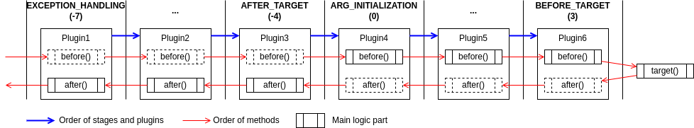

# Co-Framework

优雅高效的 Java 业务框架

**Co-Framework** 是一款专为现代 Java 开发者设计的业务框架，提供开箱即用的 API 增强、灵活的插件系统、链式调用以及可扩展的业务能力路由。
通过简化重复劳动、增强代码一致性和提升扩展能力，它显著加速开发流程并降低维护成本。适用于需要高效开发、灵活扩展的复杂业务场景。

---

## 1. 快速开始

以下是如何快速体验 Co-Framework 的核心功能：

### 1.1 API 增强：一行注解实现多项增强

#### 1.1.1 功能亮点

- 参数校验：自动调用 `validate()` 方法，确保输入合法性。
- 异常包装：异常自动转化为友好的接口返回结果。
- 调用日志：统一记录成功、失败或异常的接口调用日志。

#### 1.1.2 快速上手

1. 添加 Maven 依赖：

```xml

<dependency>
    <groupId>io.codeone</groupId>
    <artifactId>coframework-api-core</artifactId>
    <version>${coframework.version}</version>
</dependency>
```

2. 在接口服务上添加 `@API` 注解：

```java
// 类级注解，对所有方法生效增强
@API
public class BizApiImpl implements BizApi {
    // 方法级注解，对单个方法生效增强
    @API
    public Result<BizData> getData(BizParam param) {
    }
}
```

3. 自动校验参数：

```java
public class BizParam extends BaseParam {
    // 自动调用BaseParam.validate()方法，校验参数
    @Override
    public void validate() {
        Validator.requireNonNull(userId, "userId is null");
    }
}
```

4. 异常自动转化为失败结果：

```java
// 返回失败结果而不是抛出异常
// 此处返回Result.failure("INVALID_STATE", "Invalid state")
public Result<BizData> getData(BizParam param) {
    throw new ApiException(ClientErrors.INVALID_STATE);
}
```

5. 记录调用日志：

会自动记录接口调用的结果、错误码、错误信息等，无需额外配置。

### 1.2 插件系统：灵活的拦截能力

#### 1.2.1 功能亮点

- 类似 AOP，但更灵活，适合复杂场景。
- 支持多阶段、多插件动态绑定。

#### 1.2.2 快速上手

1. 添加 Maven 依赖：

```xml

<dependency>
    <groupId>io.codeone</groupId>
    <artifactId>coframework-plugin</artifactId>
    <version>${coframework.version}</version>
</dependency>
```

2. 定义插件：

```java
// 指定插件顺序和启用插件所用的注解
@Plug(value = Stages.BEFORE_TARGET, targetAnnotations = BizProcess.class)
public class BizProcessPlugin implements Plugin {
    @Override
    public void before(Method method, Object[] args) {
        // 插件逻辑
    }
}
```

3. 应用插件：

```java
// 通过注解（本例为@BizProcess）启用插件
@BizProcess
public Result<BizData> getData(BizParam param) {
}
```

### 1.3 链系统：灵活的流程编排

#### 1.3.1 功能亮点

- 支持链式调用，简化复杂业务流程。
- 节点独立、可复用，增强代码模块化。

#### 1.3.2 快速上手

1. 添加 Maven 依赖：

```xml

<dependency>
    <groupId>io.codeone</groupId>
    <artifactId>coframework-chain</artifactId>
    <version>${coframework.version}</version>
</dependency>
```

2. 定义链节点：

```java

@Component
public class Produce implements Chainable {
    @Override
    public boolean execute(Context context) {
        context.put(String.class, "content");
        return true;
    }
}

@Component
public class Consume implements Chainable {
    @Override
    public boolean execute(Context context) {
        assert "content".equals(context.get(String.class));
        return true;
    }
}
```

3. 编排并执行链：

```java

@Service
public class ChainService {
    @Autowired
    private Produce produce;
    @Autowired
    private Consume consume;

    public void run() {
        // 顺序执行
        Sequential.of(produce, consume).run(Context.of());
    }
}
```

### 1.4 扩展系统：动态路由到多实现

#### 1.4.1 功能亮点

- 针对不同业务场景动态路由到不同实现。
- 提升代码扩展性，减少重复开发。

#### 1.4.2 快速上手

1. 添加 Maven 依赖：

```xml

<dependency>
    <groupId>io.codeone</groupId>
    <artifactId>coframework-ext</artifactId>
    <version>${coframework.version}</version>
</dependency>
```

2. 定义可扩展接口：

```java
// 通过@Ability或者@ExtensionPoint注解标注可扩展接口
@Ability
public interface BizAbility {
    void execute(BizScenario bizScenario);
}
```

3. 提供不同业务场景的扩展实现：

```java
// 业务身份为"manager"的具体实现
@Extension(bizId = "manager")
public class BizAbilityForManager implements BizAbility {
    @Override
    public void execute(BizScenario bizScenario) {
        // 自定义逻辑
    }
}
```

4. 动态路由调用：

```java

@Service
public class BizService {
    // 通过接口引用
    @Autowired
    private BizAbility bizAbility;

    public void executeBizAbility() {
        // 会路由到BizAbilityForManager
        bizAbility.execute(BizScenario.ofBizId("manager"));
    }
}
```

---

## 2. API增强高级用法

框架提供了更多高级功能，帮助开发者根据需求定制异常处理、调用日志和支持现有系统的集成。以下是相关功能的介绍。

### 2.1 定制异常包装

1. 如果希望定制结果中的`errorCode`（默认为异常类名），可以让异常实现`ApiError`接口，或者使用`ApiException`。
   此时`errorCode`会取自`ApiError.getCode()`。
2. 如果希望定制结果中的`errorMessage`（默认为异常消息），比如对最终用户隐藏技术细节，可以使用`@CustomErrorMessage`注解：

```java

@API
@CustomErrorMessage("系统繁忙，请稍后重试。")
public Result<BizData> getData(BizParam param) {
}
```

### 2.2 指定错误日志等级

`ApiError.critical`决定了对应日志是`error`还是`warn`。
可以通过抛出`ApiError`类型的异常（比如`ApiException`），来指定错误日志等级：

```java
public Result<BizData> getData(BizParam param) {
    // warn - ClientErrors.INVALID_ARGS.critical = false
    throw new ApiException(ClientErrors.INVALID_ARGS);
    // error - ServerErrors.INTERNAL_SYS_ERROR.critical = true
    throw new ApiException(ServerErrors.INTERNAL_SYS_ERROR);
    // 可以参考ClientErrors和ServerErrors，定制错误日志等级
    throw new ApiException(MyErrors.CUSTOM_ERROR);
    // 可以直接指定critical
    throw new ApiException(code, critical, message);
}
```

### 2.3 定制调用日志

可以通过使用`@Logging`注解，进一步控制调用日志的行为，比如是否记录参数、是否记录返回值等。

```java

@API
@Logging(logAllArgs = false, logResult = false, expArgKvs = {"userId", "#a0?.userId"})
public Result<BizData> getData(BizParam param) {
}
```

详细的日志配置请参考**6. 日志**部分。

### 2.4 支持现有系统

框架通过不同类型的`Converter`，支持在现有系统API上应用增强。

1. `ApiParamConverter`将具备校验能力的旧接口参数，转换成`ApiParam`，以支持通过`@API`自动启用：

```java

@Component
public class MyParamApiParamConverter implements ApiParamConverter<MyParam> {
    @Override
    public ApiParam convert(MyParam source) {
        return source::check;
    }
}
```

2. `ApiResultConverter`将旧接口返回类型，转换成`ApiResult`，以准确记录调用是否成功、错误码、错误消息日志：

```java

@Component
public class MyResultApiResultConverter implements ApiResultConverter<MyResult<?>> {
    @Override
    public ApiResult<?> convert(MyResult<?> source) {
        return source.isSuccess()
                ? Result.success(source.getData())
                : Result.failure(source.getErrorCode(), source.getErrorMessage());
    }
}
```

3. `ApiErrorConverter`将异常转换成`ApiError`，以确定日志等级、记录错误码到日志、以及包装失败结果：

```java

@Component
public class MyExceptionApiErrorConverter implements ApiErrorConverter<MyException> {
    @Override
    public ApiError convert(MyException source) {
        return ApiError.of("ERR_" + source.getCode(), true, source.getMessage());
    }
}
```

4. `FailureConverter`将`ApiError`包装为旧接口返回模型，返回失败结果，而不是抛出异常：

```java

@Component
public class MyExceptionFailureConverter implements FailureConverter<MyResult<?>> {
    @Override
    public MyResult<?> convert(ApiError source) {
        return MyResult.failed(source.getErrorCode(), source.getErrorMessage());
    }
}
```

---

## 3. 插件系统高级用法

框架的插件系统提供了灵活的扩展能力，适用于复杂的业务场景。
在此部分，我们将介绍如何控制插件的执行顺序、动态绑定插件以及通过SPI实现更精细的插件管理。

### 3.1 插件顺序

- 框架定义了8个标准阶段，用于决定插件的执行顺序：

| 阶段                       | 顺序值 | 主逻辑      |
|--------------------------|-----|----------|
| PRE_ARG_INTERCEPTING     | 0   | before() |
| ARG_INTERCEPTING         | 1   | before() |
| POST_ARG_INTERCEPTING    | 2   | before() |
| BEFORE_TARGET            | 3   | before() |
| AFTER_TARGET             | -4  | after()  |
| PRE_RESULT_INTERCEPTING  | -5  | after()  |
| RESULT_INTERCEPTING      | -6  | after()  |
| POST_RESULT_INTERCEPTING | -7  | after()  |

多个插件的执行过程类似于堆栈。

以图为例，`AFTER_TARGET`阶段插件的`before()`方法，甚至早于`BEFORE_TARGET`阶段插件的`before()`方法。

因此请额外注意插件**各方法**的执行顺序，确保主逻辑放在正确的方法里。



- 如果需要精细控制同一阶段中不同插件的先后顺序，可以搭配`org.springframework.core.annotation.Order`使用：

```java

@Plug(Stages.BEFORE_TARGET)
@Order(Ordered.HIGHEST_PRECEDENCE)
public class BizProcessPlugin implements Plugin {
}
```

### 3.2 动态绑定和启用

#### 3.2.1 动态启用

可以通过`@EnablePlugin`注解动态启用插件：

```java

@EnablePlugin({FooPlugin.class, BarPlugin.class})
public Result<BizData> getData(BizParam param) {
}
```

这些插件不必指定`@Plug.targetAnnotations`。

#### 3.2.2 动态绑定

可以通过SPI来实现动态绑定，而不用提前指定`@Plug.targetAnnotations`。

SPI通过在项目启动早期建立绑定关系，解决复杂业务应用可能出现的插件循环依赖导致加载失败的问题。

1. 实现`AnnoPluginBindingFactory`工厂类，提供动态绑定关系：

```java
public class BizPluginBindingFactory implements AnnoPluginBindingFactory {
    @Override
    public List<AnnoPluginBinding> getBindings() {
        return Arrays.asList(
                AnnoPluginBinding.of(BizProcess.class, BizProcessPlugin.class));
    }
}
```

2. 在项目的`META-INF/spring.factories`中引入实现的工厂类：

```properties
io.codeone.framework.plugin.binding.AnnoPluginBindingFactory=\
  com.biz.config.BizPluginBindingFactory
```

---

## 4. 链系统高级用法

框架的链系统提供了灵活的流程编排能力，使得复杂的业务逻辑能够通过链式调用进行简洁且模块化的管理。
以下将介绍链节点的类型、流程编排以及上下文管理等高级用法，帮助更高效地构建业务流程。

### 4.1 链节点

#### 4.1.1 节点类型

链系统提供了下列节点类型：

|             | 说明                                        |
|-------------|-------------------------------------------|
| Chainable   | 提供`execute`方法，返回`false`结束链的执行，否则继续执行下一节点  |
| Continuous  | 提供`executeAndContinue`方法，方式没有返回值，不会中断链的执行 |
| Conditional | 有条件执行的节点                                  |
| Empty       | 空节点                                       |
| Sequential  | 串行执行成员节点                                  |
| Parallel    | 如果线程池可用，并行执行成员节点；否则退化为串行                  |

#### 4.1.2 Lambda表达式

`Chainable`可以写为lambda表达式，例如：

```java

@Service
public class ChainService {
    public void run() {
        Sequential.of(
                context -> {
                    context.put(String.class, "content");
                    return true;
                },
                context -> {
                    assert "content".equals(context.get(String.class));
                    return true;
                }).run(Context.of());
    }
}
```

#### 4.1.3 流程编排

可以通过`Sequential`、`Parallel`进行流程编排：

```java
private Chainable getChain() {
    return Sequential.of(
            // 并行生产
            Parallel.of(
                    mapProduceFoo,
                    mapProduceBar,
                    mapProduceBaz),
            // 生产汇合
            reduceProduce,
            // 并行消费
            Parallel.of(
                    mapConsumeFoo,
                    mapConsumeBar,
                    mapConsumeBaz),
            // 消费汇合
            reduceConsume);
}
```

### 4.2 上下文

`Context`上下文内部持有参数的map，提供了`get`、`put`、`computIfAbsent`等常见map操作。并且是线程安全的。

#### 4.2.1 整体输入和输出

可以通过上下文进行链整体的输入和输出：

```java
public void run(Input input) {
    return getChain().run(Context.of(Input.class, input));
}

public Output runAndReturn(Input input) {
    // 即返回context.get(Output.class)
    return getChain().run(Context.of(Input.class, input), Output.class);
}
```

#### 4.2.2 参数类型

上下文参数支持任意类型的参数key，比如字符串、枚举。

但是，如果使用`Class<?>`或者`Typed`作为参数key，则读写参数时会进行类型校验。

如何定义`Typed`类型参数：

```java

@RequiredArgConstructor
@Getter
public enum TypedParamEnum implements Typed {
    INPUT(Input.class),
    // 类型同为Input.class的另一个参数
    INPUT2(Input.class),
    OUTPUT(Output.class),
    ;
    private final Class<?> type;
}
```

#### 4.2.3 线程池

如果上下文中提供了线程池，则`Parallel`下的成员节点将被并发执行。

请确保成员节点间是线程安全的。

```java
public void run(Input input) {
    return getChain().run(Context.of()
            .threadPool(ForkJoinPool.commonPool()));
}
```

### 4.3 日志

链节点的执行会记录日志，格式如下：

```json5
{
  // 通过Context.of().chainName("chainName")指定，默认为"anonymous"
  "chain": "chainName",
  // 节点类名
  "node": "ClassNameOfNode",
  // 业务身份
  "bizId": "bizId",
  // 场景
  "scenario": "scenario",
  // 执行时间
  "elapsed": 0,
  // 如果链节点抛出异常，则会记录exception
  "exception": "stringOfException",
  // 如果链节点返回false，则会记录break
  "break": true,
  // 可通过Context.log("key", value)来记录
  "params": {
    "param1": "{}",
    "param2": "{}"
  }
}
```

- 设置链名称：

```java
public void run() {
    getChain().run(Context.of().chainName("chainName"));
}
```

- 按需记录日志：

```java

@Component
public class Produce implements Chainable {
    @Override
    public boolean execute(Context context) {
        context.log("key", value);
    }
}
```

- 每个节点统一记录日志：

上下文提供了`onExecute`方法，可以在执行链时统一配置日志记录行为，确保日志的一致性和可追溯性。

```java
public void run(Input input) {
    getChain().run(Context.of(Input.class, input)
            .onExecute(context -> {
                // 在每个节点输出userId，帮助追踪执行链
                context.ifPresent(Input.class, o -> context.log("userId", o.getUserId()));
            }));
}
```

### 4.4 可扩展链节点

如果使用可扩展接口（而不是具体类）作为链节点，则可以实现链节点的可扩展性
——根据上下文中的业务身份场景，在运行时动态路由到不同的链节点实现。

（可扩展（"Extensible"）接口、扩展（"Extension"）实现，以及业务身份场景（`BizScenario`）概念请参考**5. 扩展系统**）

1. 可扩展接口作为链节点：

```java
// 注意本节点只是接口，而不是具体类
@Ability
public interface Consume extends Chainable {
}
```

2. 为不同的业务身份场景提供不同的扩展实现：

```java
// 业务身份为"foo"的Consume接口的实现
@Extension(bizId = "foo")
public class ConsumeForFoo implements Consume {
}
```

3. 可扩展链节点的调用：

```java

@Service
public class ChainService {
    @Autowired
    private Produce produce;
    // 引用接口，而不关心具体类
    @Autowired
    private Consume consume;

    public void run() {
        Sequential.of(produce, consume).run(Context.of()
                // 会路由到ConsumeForFoo
                .bizScenario(BizScenario.ofBizId("foo")));
    }
}
```

---

## 5. 扩展系统高级用法

框架的扩展系统旨在提升系统的灵活性和可扩展性。通过可扩展接口和动态路由机制，可以在运行时根据不同的业务身份场景选择适当的实现。
以下将介绍如何使用扩展接口、扩展实现和业务身份场景等功能，以应对更复杂的业务需求。

### 5.1 可扩展接口

可扩展（"Extensible"）接口可以有多个扩展实现，运行时根据参数或者上下文中的业务身份场景，路由到其中一个具体的实现。

扩展系统提供了`@Ability`和`@ExtensionPoint`两个注解来标记可扩展接口。
两者功能完全一样，但业务语义有所不同：

- 能力（`@Ability`）：一般用来代表可扩展的能力、功能等，抽象层次较高。
- 扩展点（`@ExtensionPoint`）：一般用来代表可扩展的规则、配置等，抽象层次偏低。

示例：

```java

@Ability
public interface BizAbility {
    void execute(BizScenario bizScenario);
}
```

### 5.2 扩展实现

一个扩展（"Extension"）实现是可扩展接口在特定业务身份场景下的实现。

扩展系统通过`@Extension`注解标记扩展实现，并指定其实现的业务身份场景，例如：

```java

@Extension(bizId = "region.branch", scenarios = {"weekday.monday", "weekday.tuesday"})
public class BizAbilityForBranchMonday implements BizAbility {
}
```

### 5.3 业务身份场景

业务身份场景（`BizScenario`）包含调用者业务身份`bizId`和场景`scenario`，是用来路由到具体扩展实现的坐标。

业务身份和场景均支持层级，路由时会从具体到宽泛进行匹配。

举个例子，假设参数或者上下文中的`BizScenario`为`"region.branch|weekday.monday"`，
则扩展系统会依次查找下列扩展实现，并匹配第一个命中的（如果全部不命中，则抛出异常）：

1. `@Extension(bizId = "region.branch", scenarios = "weekday.monday")`
2. `@Extension(bizId = "region.branch", scenarios = "weekday")`
3. `@Extension(bizId = "region.branch", scenarios = "*")`
4. `@Extension(bizId = "region", scenarios = "weekday.monday")`
5. `@Extension(bizId = "region", scenarios = "weekday")`
6. `@Extension(bizId = "region", scenarios = "*")`
7. `@Extension(bizId = "*", scenarios = "weekday.monday")`
8. `@Extension(bizId = "*", scenarios = "weekday")`
9. `@Extension(bizId = "*", scenarios = "*")`

### 5.4 获取路由参数

当调用可扩展接口时，扩展系统从两个地方获取路由参数（即业务身份场景）：

1. 类型为`BizScenarioParam`的方法参数，其`getBizScenario()`方法返回业务身份场景。
2. 上下文`BizScenarioContext`，内部是一个堆栈，栈顶存放最后一次路由所用到的业务身份场景。

#### 5.4.1 获取过程

扩展系统默认按下列顺序获取路由参数：

1. 如果扩展方法没有参数，从上下文中获取。
2. 如果方法仅有一个参数带`@RouteBy`注解，且是`BizScenarioParam`类型，使用该参数。
3. 如果方法或者服务带`@RouteByContext`注解，从上下文中获取。
4. 如果方法仅有一个参数为`BizScenarioParam`类型，使用该参数。
5. 兜底从上下文中获取。

如果上下文中也没有，则抛出异常。

#### 5.4.2 路由上下文

可以手动将业务身份场景压入上下文，用于后继链路，例如：

```java
public void run() {
    // bizScenario在process()全程可用
    BizScenarioContext.invoke(bizScenario, this::process);
}
```

注意：上下文是`ThreadLocal`，不跨线程。

#### 5.4.3 扩展会话

扩展会话通过`@ExtensionSession`注解，自动将可用的业务身份场景压入上下文：

| `@ExtensionSession.value` | 说明                                            |
|---------------------------|-----------------------------------------------|
| FIRST                     | 使用第一个`BizScenarioParam`类型的参数                  |
| LAST                      | 使用最后一个`BizScenarioParam`类型的参数                 |
| SPECIFIED                 | 使用`@RouteBy`注解指定的参数（必须是`BizScenarioParam`类型）  |
| CUSTOM                    | 使用`@ExtensionSession.customResolver`从所有参数里解析  |
| IGNORE                    | 不修改上下文                                        |
| AUTO（默认值）                 | 依次尝试`CUSTOM`、`SPECIFIED`、`FIRST`，兜底采用`IGNORE` |

`@ExtensionSession`注解一般用于API层，在调用入口填充上下文。
这样可扩展接口可以不必带`BizScenarioParam`类型参数，减少代码侵入性。例如：

```java

@API
@ExtensionSession
public class BizApiImpl implements BizApi {
    @Autowired
    private BizAbility bizAbility;

    // 假设BizParam实现了BizScenarioParam
    public Result<BizData> getData(BizParam param) {
        // 可扩展接口没有额外参数也能路由
        bizAbility.runWithoutParam();
    }
}
```

---

## 6. 日志

框架提供灵活的日志功能，支持自动注解记录和手动编程记录两种方式，并提供多种日志格式选择。

### 6.1 自动记录（注解方式）

在方法上添加`@Logging`注解即可自动记录调用日志：

```java

@Logging(
        // 日志分类名（默认使用类名）
        name = "business",
        // 是否记录全部参数（默认为true。如果expArgKvs有值则切换为记录指定的表达式）
        logAllArgs = true,
        // 是否记录返回值（默认为true）
        logResult = true,
        // 是否记录异常堆栈（默认true）
        logStackTrace = true,
        // 调用是否成功的SpEL表达式（默认不需要！框架能识别ApiResult兼容模型）
        expSuccess = "#r?.success",
        // 错误码的SpEL表达式（默认不需要！框架能识别ApiResult、ApiError兼容模型）
        expCode = "#r?.errorCode",
        // 错误消息的SpEL表达式（默认不需要！框架能识别ApiResult兼容模型）
        expMessage = "#r?.errorMessage",
        // 关键参数的键值对列表。键为String，值为SpEL表达式
        expArgKvs = {"bizScenario", "#a0?.bizScenario",
                "userId", "#a0?.userId"})
public Result<BizData> run(BizParam param) {
    // 业务逻辑
}
```

#### 主要功能：

- 自动识别ApiResult、ApiError兼容模型
- 根据调用成功/失败/异常、ApiError.critical，自动计算日志等级
- `@API`具有相同功效，但`@Logging`提供更多选项
- `@Logging`可以和`@API`搭配使用，对`@API`进行调整

### 6.2 手动记录（编程方式）

通过`Log`类实现灵活的手动日志记录：

```java
public Result<BizData> run(BizParam param) {
    // 示例1
    Log.newLog()
            .setMethod(method)
            .setElapsed(150)
            .setArgs(args)
            .setResult(result)
            .log();

    // 示例2
    Log.newLog()
            .setLoggerName("audit")
            .setLevel(Level.WARN)
            .setMethodName("BizService.run")
            .putContext("traceId", TracingContext.getTraceId())
            .addArg("userId", request.getUserId())
            .setCode("INVALID_INPUT")
            .setMessage("Missing required field")
            .config(LogFeature.LOG_RESULT, false)
            .log();
}
```

#### 主要功能：

- 链式调用构建日志内容
- 自动识别ApiResult、ApiError兼容模型
- 根据调用成功/失败/异常、ApiError.critical，自动计算日志等级
- 支持自定义上下文（`putContext()`）
- 灵活配置参数记录（`addArg()`/`setArgMap()`）
- 按需开启/关闭日志特征（`config()`）

### 6.3 日志格式配置

通过`application.properties`配置日志格式：

```properties
# 可选值：json/logfmt/custom（默认自动检测）
coframework.log.format=json
# 仅当coframework.log.format=custom时生效
coframework.log.custom.entrySeparator=||
coframework.log.custom.keyValueDelimiter==>
```

#### 格式说明：

**1. JSON格式（需jackson-databind依赖）**

```json
{
  "level": "WARN",
  "method": "BizService.run",
  "success": false,
  "code": "ERROR_CODE",
  "message": "error message",
  "elapsed": 150,
  "args": {
    "userId": 10000,
    "flag": true
  },
  "result": "{\"status\":\"PENDING\"}",
  "exception": "ValidationException: Invalid input"
}
```

**2. Logfmt格式（无jackson-databind依赖时默认）**

```
level=WARN method=BizService.run success=false code=ERROR_CODE 
message="error message" elapsed=150 args.userId=10000 args.flag=true 
result="{\"status\":\"PENDING\"}" exception="ValidationException: Invalid input"
```

**3. 自定义格式**

```
level=>WARN||method=>BizService.run||success=>false||code=>ERROR_CODE||
message=>"error message"||elapsed=>150||args.userId=>10000||args.flag=>true||
result=>"{\"status\":\"PENDING\"}"||exception=>"ValidationException: Invalid input"
```

#### 格式自动检测逻辑：

1. 当配置为`json`但无Jackson依赖时，自动降级为`logfmt`
2. 未显式配置时，有Jackson环境默认用`json`，否则用`logfmt`

### 6.4 日志内容规范

所有格式共享以下字段：

| 字段        | 说明         | 出现条件          |
|-----------|------------|---------------|
| level     | 日志级别（自动推导） | 始终存在          |
| method    | 方法标识       | 始终存在          |
| success   | 业务成功状态     | 有明确结果时        |
| code      | 业务错误码      | 失败/异常时        |
| message   | 业务提示信息     | 失败/异常时        |
| elapsed   | 耗时(ms)     | 手动设置时         |
| args.*    | 参数键值对      | 有参数记录时        |
| result    | 返回值        | 非void方法且开启记录时 |
| exception | 异常摘要       | 发生异常时         |
| ctx.*     | 自定义上下文     | 手动添加时         |

---

希望Co-Framework能成为您开发过程中得力的助手，助力您的业务系统更高效、稳定地运行。